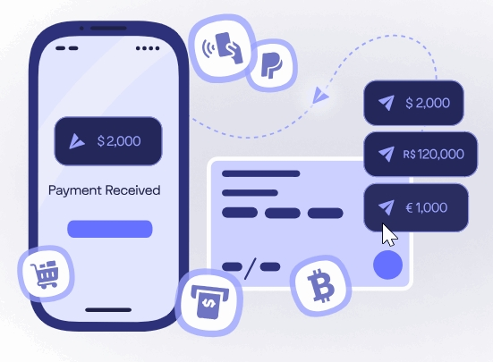

# 📋 Complete Portfolio Content Modification Guide

## 📁 **PROJECT STRUCTURE**
```
portfolio/
├── index.html                    # 🏠 Main website file
├── assets/
│   ├── css/style.css            # 🎨 Styling
│   ├── js/
│   │   ├── script.js            # ⚡ Main functionality
│   │   ├── project-data.js      # 💼 Project data (IMPORTANT!)
│   │   └── content-loader.js    # 📄 Content loader
│   └── images/                  # 🖼️ All images
├── data/project.json            # 💼 Alternative project data
├── content/                     # 📝 Markdown content
├── netlify.toml                # ⚙️ Netlify configuration
└── project.html                # 📄 Project detail page
```

---

## 🎯 **STEP-BY-STEP CONTENT MODIFICATION**

### **1. 👤 PERSONAL INFORMATION**
**File: `index.html`**

#### **Your Name & Title**
```html
<!-- Line 52: Your Name -->
<h1 class="name" title="Thomas Tran">Thomas Tran</h1>

<!-- Line 54: Your Job Title -->
<p class="title">Devops Engineer</p>

<!-- Line 8: Page Title -->
<title>vCard - Personal Portfolio</title>
```
**🔧 Change to:**
- Replace "Thomas Tran" with your name
- Replace "Devops Engineer" with your profession
- Update page title

#### **Profile Avatar**
```html
<!-- Line 48: Profile Image -->

```
**🔧 Change to:**
- Replace `my-avatar.png` with your photo
- Update alt text to your name

#### **Contact Information**
```html
<!-- Line 80: Email -->
<a href="mailto:thomastran6832@gmailc.com" class="contact-link">thomastran6832@gmailc.com</a>

<!-- Line 94: Phone -->
<a href="tel:+84961407981" class="contact-link">+(84) 96140-7981</a>

<!-- Line 108: Birthday -->
<time datetime="1982-06-23">June 23, 1982</time>

<!-- Line 122: Location -->
<address>Ho Chi Minh City, Vietnam</address>
```

#### **Social Media Links (Lines 135-153)**
```html
<li class="social-item">
  <a href="#" class="social-link">
    <ion-icon name="logo-facebook"></ion-icon>
  </a>
</li>
<li class="social-item">
  <a href="#" class="social-link">
    <ion-icon name="logo-twitter"></ion-icon>
  </a>
</li>
```
**🔧 Replace "#" with your social media URLs**

---

### **2. 📖 ABOUT ME SECTION**
**File: `index.html` (Lines 212-233)**

```html
<p>
  I'm Creative Director and UI/UX Designer from Sydney, Australia, working in web development and print media.
  I enjoy turning complex problems into simple, beautiful and intuitive designs.
</p>

<p>
  My job is to build your website so that it is functional and user-friendly but at the same time attractive.
  Moreover, I add personal touch to your product and make sure that is eye-catching and easy to use.
</p>
```
**🔧 Replace with your own description**

---

### **3. 🛠️ SERVICES/WHAT I DO SECTION**
**File: `index.html` (Lines 240-310)**

**Current Services:**
1. **CI/CD & Automation** (Lines 242-252)
2. **Cloud Infrastructure** (Lines 258-268)
3. **Containerization & Orchestration** (Lines 274-284)
4. **Monitoring & Incident Response** (Lines 290-300)

**Service Template:**
```html
<div class="service-item">
  <div class="service-icon-box">
    
  </div>
  <div class="service-content-box">
    <h4 class="h4 service-item-title">Your Service Title</h4>
    <p class="service-item-text">
      Your service description here.
    </p>
  </div>
</div>
```

---

### **4. 🎯 SKILLS SECTION**
**File: `index.html` (Lines 640-695)**

**Skill Template:**
```html
<li class="skills-item">
  <div class="title-wrapper">
    <h5 class="h5">Docker & Kubernetes</h5>
    <data value="90">90%</data>
  </div>
  <div class="skill-progress-bg">
    <div class="skill-progress-fill" style="width: 90%;"></div>
  </div>
</li>
```

**Current Skills:**
- Docker & Kubernetes (90%)
- AWS/GCP/Azure (80%)
- CI/CD (Jenkins/GitLab) (70%)
- Infrastructure as Code (80%)

**🔧 To modify:**
1. Change skill name in `<h5>`
2. Update percentage in `<data value="XX">XX%</data>`
3. Update progress bar width: `style="width: XX%;"`

---

### **5. 🎓 RESUME - EDUCATION**
**File: `index.html` (Lines 530-575)**

**Education Template:**
```html
<li class="timeline-item">
  <h4 class="h4 timeline-item-title">University school of the arts</h4>
  <span>2007 — 2008</span>
  <p class="timeline-text">
    Description of your education, achievements, or relevant coursework.
  </p>
</li>
```

---

### **6. 💼 RESUME - WORK EXPERIENCE**
**File: `index.html` (Lines 587-635)**

**Experience Template:**
```html
<li class="timeline-item">
  <h4 class="h4 timeline-item-title">Creative director</h4>
  <span>2015 — Present</span>
  <p class="timeline-text">
    Description of your role, responsibilities, and achievements.
  </p>
</li>
```

---

### **7. 💼 PORTFOLIO PROJECTS** ⭐ **MOST IMPORTANT**

#### **Method 1: Edit JavaScript File (Recommended)**
**File: `assets/js/project-data.js`**

```javascript
const projectsData = {
    "projects": [
        {
            "id": "project1",
            "title": "E-Commerce Website",
            "description": "A fully responsive e-commerce platform...",
            "image": "./assets/images/project-1.jpg",
            "technologies": ["React", "Node.js", "MongoDB"],
            "github": "https://github.com/yourusername/project1",
            "demo": "https://project1-demo.com",
            "category": "web development"
        }
    ]
};
```

**🔧 To add your projects:**
1. **Replace project data** with your own
2. **Update images** in `assets/images/` folder
3. **Change GitHub URLs** to your repositories
4. **Update demo links** to your live projects

#### **Method 2: Edit JSON File**
**File: `data/project.json`**
- Same structure as above but in JSON format
- Use if you prefer JSON over JavaScript

#### **Method 3: Edit HTML Directly**
**File: `index.html` (Lines 773-930)**
```html
<li class="project-item active" data-filter-item data-category="web development">
  <a href="#">
    <figure class="project-img">
      <div class="project-item-icon-box">
        <ion-icon name="eye-outline"></ion-icon>
      </div>
      
    </figure>
    <h3 class="project-title">Finance</h3>
    <p class="project-category">Web development</p>
  </a>
</li>
```

---

### **8. 📝 BLOG SECTION**
**File: `index.html` (Lines 1030-1180)**

**Blog Post Template:**
```html
<li class="blog-post-item">
  <a href="#">
    <figure class="blog-banner-box">
      
    </figure>
    <div class="blog-content">
      <div class="blog-meta">
        <p class="blog-category">Design</p>
        <span class="dot"></span>
        <time datetime="2022-02-23">Fab 23, 2022</time>
      </div>
      <h3 class="h3 blog-item-title">Design conferences in 2022</h3>
      <p class="blog-text">
        Your blog post summary...
      </p>
    </div>
  </a>
</li>
```

---

### **9. 📞 CONTACT FORM**
**File: `index.html` (Lines 1220-1240)**

#### **Contact Message**
```html
<!-- Lines 1214-1216: Contact Introduction -->
<p>Ready to start your next project? Let's discuss how I can help you achieve your DevOps and infrastructure goals. I'm always open to new opportunities and collaborations.</p>
```

#### **Form Configuration**
```html
<!-- Line 1223: Form Action -->
<form action="https://formspree.io/f/xpzgkqyv" method="POST" class="form" data-form>
```
**🔧 To set up:**
1. Go to [formspree.io](https://formspree.io)
2. Create account and form
3. Replace `xpzgkqyv` with your form ID

---

## 🖼️ **IMAGE REPLACEMENT GUIDE**

### **📁 Images to Replace in `assets/images/`:**

#### **Essential Images:**
- `my-avatar.png` - **Your profile photo**
- `logo.ico` - **Your favicon**

#### **Project Images:**
- `project-1.jpg` to `project-9.png` - **Your project screenshots**
- Update filenames in project data accordingly

#### **Blog Images:**
- `blog-1.jpg` to `blog-6.jpg` - **Your blog post images**

#### **Service Icons (Optional):**
- `icon-design.svg`, `icon-dev.svg`, etc. - **Service icons**

---

## 🔗 **HOW EVERYTHING CONNECTS**

### **🔄 Data Flow:**
1. **`index.html`** - Main structure and static content
2. **`assets/js/project-data.js`** - Dynamic project data
3. **`assets/js/script.js`** - Interactive functionality
4. **`assets/css/style.css`** - All styling
5. **`assets/images/`** - All visual assets

### **🎯 Key Connections:**
- **Projects**: JavaScript loads from `project-data.js` into HTML
- **Images**: Referenced by path in HTML and JavaScript
- **Styles**: CSS classes connect HTML to styling
- **Contact**: Form submits to external service (Formspree)

---

## ✅ **QUICK CUSTOMIZATION CHECKLIST**

### **Essential Changes:**
- [ ] **Personal Info**: Name, title, contact details
- [ ] **Profile Photo**: Replace `my-avatar.png`
- [ ] **About Section**: Write your description
- [ ] **Projects**: Update `project-data.js` with your projects
- [ ] **Project Images**: Add your project screenshots
- [ ] **Skills**: Update skills and percentages
- [ ] **Contact Form**: Set up Formspree
- [ ] **Social Links**: Add your social media URLs

### **Optional Changes:**
- [ ] **Services**: Modify what you offer
- [ ] **Resume**: Add education and experience
- [ ] **Blog Posts**: Add your articles
- [ ] **Colors/Styling**: Modify CSS if needed
- [ ] **Favicon**: Replace `logo.ico`

---

## 🚀 **DEPLOYMENT**

### **Quick Deploy to Netlify:**
1. **Create Account**: Go to [netlify.com](https://netlify.com)
2. **Deploy**: Drag your portfolio folder to Netlify
3. **Your Site**: Gets URL like `https://amazing-name.netlify.app`
4. **Custom Domain**: Optional - add your own domain

### **Alternative Hosting:**
- **GitHub Pages**: Free hosting via GitHub
- **Vercel**: Simple deployment platform
- **Firebase Hosting**: Google's hosting service

---

## 🎯 **MOST IMPORTANT FILES TO EDIT**

### **🔥 Priority 1 (Essential):**
1. **`index.html`** (Lines 52, 54, 80, 94, 212-233) - Personal info & about
2. **`assets/js/project-data.js`** - Your projects
3. **`assets/images/my-avatar.png`** - Your photo

### **⚡ Priority 2 (Important):**
1. **`index.html`** (Lines 640-695) - Skills section
2. **`assets/images/project-*.jpg`** - Project images
3. **`index.html`** (Lines 1214-1216) - Contact message

### **✨ Priority 3 (Optional):**
1. **`index.html`** (Lines 530-635) - Resume sections
2. **`index.html`** (Lines 1030-1180) - Blog posts
3. **`assets/css/style.css`** - Styling changes

---

## 📞 **NEED HELP?**

### **Common Issues:**
1. **Images not showing**: Check file paths and names
2. **Projects not loading**: Check JavaScript console for errors
3. **Contact form not working**: Set up Formspree properly
4. **Styling issues**: Check CSS file and class names

### **Resources:**
- **Ion Icons**: [ionicons.com](https://ionicons.com) - For icons
- **Google Fonts**: [fonts.google.com](https://fonts.google.com) - For fonts
- **Formspree**: [formspree.io](https://formspree.io) - For contact forms

---

**🎉 Your portfolio is ready to be customized! Start with Priority 1 items and work your way through the checklist.**